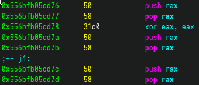
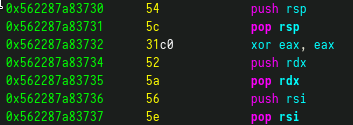

# War

```
Summary:
  I	- Usage
  II	- History
  III	- Method
  IV	- Virus flow
```

## Disclaimer

Welcome to the wonderful world of viruses, viruses and threats of <insert random anti-virus software> ...
Your goal is to put your skills on handling binary files and make your first virus.
> DISCLAIMER: This project is only for **educational purposes**.

---

Bienvenue dans le monde merveilleux des virus, trojans et autres hantises de <Insert random antiVirus software> ...
Votre but ici est de mettre vos competences sur la manipulation des fichiers binaires et faire votre premier virus.
> ATTENTION : Ce projet est uniquement a **but pedagogique**.


### I - Usage

```shell
$> make
$> ./run.sh create	# it creates /tmp/test1 and /tmp/test2 directories and populate it with basic binaries.
$> ./death		# yeaaaaa
$> ./run.sh search	# it looks into /tmp/test1 and /tmp/test2 and check for infected binaries.

hint: You can enable debug log by uncomment `#-D DEBUG` in the Makefile and then 'make re'.
Look at '/tmp/death.log' to follow the execution flow.
```

## II - History


Firstly, I have to say that without @Jle-quel this project would either never ever occurred or ever be this far.
All of this started with an [elf packer](https://github.com/DjeDt/woody_woodpacker/) that inject some code and encrypt an Elf x64 binary and decrypt it at runtime.

After the packer was done, we unlocked the virus project branch of our school that leads us to make first a simple replicate virus and then for the end a polymorphic or metamorphic virus.

So at first we had to create a simple virus that replicate itself into other binaries [(project pdf)](docs/1_Famine.fr.pdf).
Then we had to add obfuscation to complicate reverser works [(project pdf)](docs/2_Pestilence.fr.pdf).
Finally, we our last addition is the implementation of a polymorphic routine that structurally modifies balised code. [(project pdf)](docs/4_Death.fr.pdf).

## III - View

In Death, we implemented a pt_note infection as describe by Elfmaster in his book [book name] .
This infection method is useful because instead of the segment padding infection, pt_note allow us to infect a binary without any size limit.
It's visible but this project is not aim to be a silent virus, be to learn as much as possible.

We decided to write this project in a totally new way that allow us to prevent static reverse way better than with traditional code. We implemented a one go execution. As you can see, each function call the next one without turning back.

This leads to the encryption method. Each function is the key that will be use to decrypt the next one. the called function will encrypt asap the caller function, execute and decrypt the next one etc etc. It prevents static and dynamic analysis and allow to do marlouteries during the execution. Any software breakpoints will break the decryption key and will leads to a segfault.


## IV - Flow:

(there is comments above each functions that are pretty much the same than here)

**Start**: From the host, the main is called and aim to tranform the binary like an infected should be. From an infected binary, start() (it's the entrypoint) backup all registers, save the stack pointeur and decrypt the first encrypted data. [A REFORMULER]

Antidebug:	Death look if the current proccess is traced by a debugger like gdb or radare2 by using ptrace.
			If yes, it exit and give the hand to the father, which exit by using WEXITSTATUS.

**Opening**:	iterate into /proc/* directories and look for antivirus proccess that could be running at the same time than Death. Currently antivirus proccess are 'test' and 'antivirus'. Both antidebug() and opening() are quite trivial and can be easily bypassed, but it can give a simple way to understand how anti debug measures can be done.

**War**: Now that we are sure that there is nothing bad on the system host (as far as we know), let's choose aleatory directories to infect. If executed as root, it will go into {/sbin, /usr/sbin, /bin/, /usr/bin} directories. if anything else, into {/tmp/test1,/tmp/test2}.

**Locate**: locate count each binaries inside chosen directory, do the sum and then select randomly (again) one of it.

**Inspect**: Now we do some check (elf, executable, data corruption ...) on the selected file to know if it can be infected.

**Infect**: Now that we are sure that the selected binary can be infected, we change the metadata to have enough room for the injection. We locate the pt_note segment and then transform it to a pt_load segment and gave it read, write, execution permission. This way we are sure to be loaded with the original binary. We also strip all section during the process to remove the symbol table and to be as light as we can.

**Inject**: This is in my opinion the most interesting part. This is where we modify, polymorph and encrypt our data. This function is divided in step so you can follow the flow easily. Our polymorphism is based on the use of placeholder code that we add to our rc4 function. It change the register used for the push/pop instructions by random registers.

```


```

**Patch**: this function is designed to patch injected data. we modify the `jmp __exit` instruction in end() to `jmp real_binary`. furthermore this is where we encrypt all the binary using _rc4().

**Release**: is dedicated to replication. we run the newly infected binary with `--help` argument so we can avoid surprise like run an infected 'shutdown' or 'reboot' .. Inside the child, we close stdin/out/err in order to get rid of any input/output and then execve and give back hand to the father.

**Erase**: Here we are suppressing what is left in the memory to avoid a memory dump or to counter reverse. we replace data by some random or if not, by zero.

End: end is our placeholder to get back our primary rbp so we can get pop back all of our register. Since we did not do any return, our stack pointer constantly grown, so we have to get it back like if we had to. the `jmp __exit` is here to exit if we are the 0 infection (aka ./death), or to `jmp __entrypoint` if it's about an infected.

## V - Conclusion

So what did we learn? I would say a lot.
We learnt a lot about encryption, binary file format (especially ELF, how the kernel load it ..), how to use debugger like gdb or radare2, about how a defined architecture can be reversed.

It was a great journey, thanks for reading !
